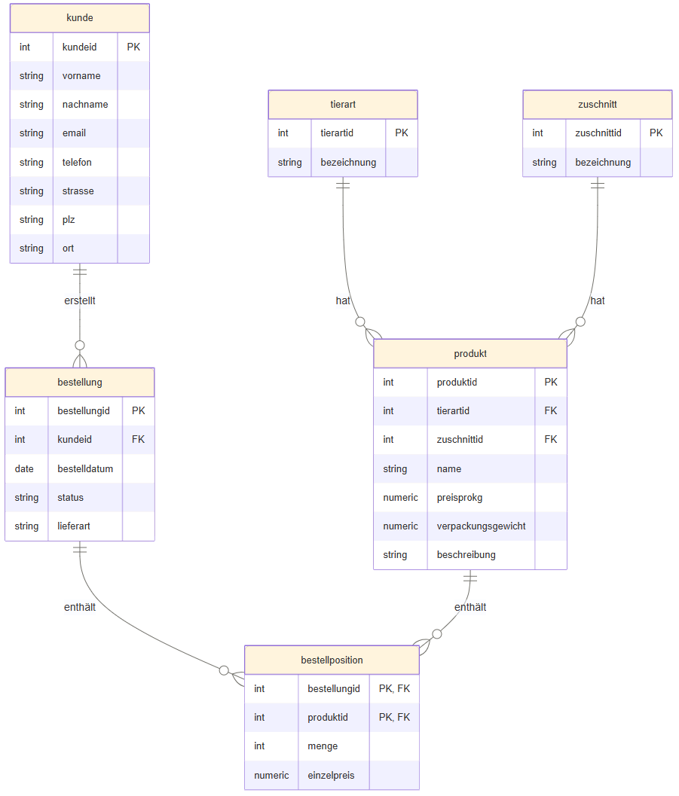

# Datenbankprojekt: Fleisch-Onlineshop
 
## 1. Einleitung
 
Im Rahmen dieses Schulprojekts wurde eine relationale Datenbank für einen fiktiven Online-Fleisch-/Metzgereishop (`meat_shop`) entworfen und implementiert. Ziel war es, ein vollständiges Datenmodell zu entwickeln und dieses als funktionsfähige PostgreSQL-Datenbank umzusetzen.
 
**Projektumfang:**
- Entwurf eines ER-Modells und eines logischen Crow's-Foot-Diagramms
- Implementierung des Schemas in PostgreSQL (Standard-SQL, DDL)
- Kein GUI, keine Anwendungslogik
- Keine erweiterten Datenbankfeatures (z. B. Trigger, Stored Procedures)
- Geschätzter Aufwand: ca. 5–10 Stunden
**Nicht Teil des Projekts:**
- Frontend/Backend-Anwendung
- Performance-Optimierung, Indizierung über das Nötigste hinaus
- Mehrbenutzer-Rechteverwaltung über Basis-Rollen hinaus
---
 
## 2. Technologiewahl
 
### 2.1 PostgreSQL
 
PostgreSQL ist ein objektrelationales Open-Source-Datenbankmanagementsystem (DBMS), das für seine Standardkonformität, Stabilität und Erweiterbarkeit bekannt ist.
 
**Begründung der Wahl:**
Da es sich beim Fleisch-Onlineshop um klar strukturierte, stark verknüpfte Daten handelt (Kunden, Produkte, Bestellungen), eignet sich ein relationales Modell mit definierten Beziehungen und Integritätsregeln besonders gut. PostgreSQL wurde gewählt, da es kostenlos, weit verbreitet und in der Praxis (Industriestandard) relevant ist.
 
**Vorteile:**
- Open Source, keine Lizenzkosten
- Sehr standardkonformes SQL
- Starke Unterstützung für Constraints (`CHECK`, `FOREIGN KEY`, `UNIQUE`) – wichtig für ein sauberes 3NF-Schema
- Hohe Verbreitung in der Praxis, guter Lerneffekt
- Umfangreiche, gute Dokumentation
**Nachteile:**
- Für ein Projekt dieser Größenordnung funktional überdimensioniert
- Administration (Rollen, Rechte, `pg_hba.conf`) komplexer als bei einfacheren Systemen (z. B. SQLite)
- Erfordert einen dauerhaft laufenden Serverprozess, kein Einzeldatei-Format
### 2.2 DBeaver
 
DBeaver ist ein universeller, grafischer SQL-Client zur Verwaltung verschiedenster Datenbanksysteme.
 
**Begründung der Wahl:**
Da die PostgreSQL-Instanz auf einer separaten Debian-VM läuft und remote vom Windows-Host aus administriert werden musste, wurde ein plattformunabhängiger Client mit stabiler Remote-Verbindung benötigt. DBeaver Community Edition erfüllt diese Anforderung kostenlos.
 
**Vorteile:**
- Kostenlose Community Edition
- Plattformunabhängig (Windows-Host → Debian-VM)
- Unterstützt viele verschiedene DBMS, nicht nur PostgreSQL
- SQL-Script-Editor eignet sich gut zur nachvollziehbaren, dokumentierbaren Skripterstellung
- Übersichtliche grafische Darstellung von Schema und Tabellen
**Nachteile:**
- Integrierte ER-Diagramme sind rein technisch und kein Ersatz für ein formelles Crow's-Foot-Diagramm
- Community Edition mit eingeschränktem Funktionsumfang gegenüber der Enterprise-Version
- Anfängliche Einstiegshürde durch Verbindungs- und Rechteprobleme (siehe Abschnitt 3)
---
 
## 3. Infrastruktur
 
- **Datenbankserver:** PostgreSQL 17 auf einer Debian-VM
- **Client:** DBeaver Community Edition auf einem Windows-Host, Remote-Zugriff auf die VM
- **Setup-Hinweise:**
  - PostgreSQL 15+ erfordert explizite Schema-Ownership zusätzlich zu Datenbank-Rechten (`GRANT ALL PRIVILEGES ON DATABASE` allein reicht nicht mehr aus) – gelöst über `ALTER DATABASE` und `ALTER SCHEMA` Ownership-Änderungen
  - Zugriff aus dem Netzwerk wurde über `pg_hba.conf` mit `scram-sha-256`-Authentifizierung und CIDR-Notation (z. B. `10.2.4.0/24`) konfiguriert, um dynamische IPs im Subnetz abzudecken
  - `listen_addresses = '*'` in `postgresql.conf` gesetzt, um Remote-Verbindungen zuzulassen
  - `systemctl enable --now postgresql` sorgt für automatischen Start beim Booten
---
 ## 4. Datenmodellierung

### 4.1 Crow's-Foot-Diagramm



Das Diagramm zeigt das logische Datenmodell in Crow's-Foot-Notation: alle sechs Tabellen mit ihren Attributen, Primärschlüsseln (`PK`), Fremdschlüsseln (`FK`) sowie den Kardinalitäten zwischen den Tabellen.

**Entitäten:**

- **Tierart** – Art des verarbeiteten Tieres (z. B. Rind, Schwein)
- **Zuschnitt** – Zuschnittsart des Fleischstücks (z. B. Filet, Hüfte)
- **Kunde** – Kundendaten inkl. Kontakt- und Lieferadresse
- **Produkt** – Verkaufbares Produkt, verknüpft mit genau einer Tierart und einem Zuschnitt
- **Bestellung** – Bestellkopf, verknüpft mit genau einem Kunden
- **Bestellposition** – Auflösung der M:N-Beziehung zwischen Bestellung und Produkt, inkl. Menge und historischem Einzelpreis; zusammengesetzter Primärschlüssel aus `BestellungID` und `ProduktID`

**Beziehungen und Kardinalitäten:**

| Beziehung | Kardinalität | Bedeutung |
|---|---|---|
| `Tierart` → `Produkt` | 1 : N | Eine Tierart kann in mehreren Produkten vorkommen |
| `Zuschnitt` → `Produkt` | 1 : N | Ein Zuschnitt kann in mehreren Produkten vorkommen |
| `Kunde` → `Bestellung` | 1 : N | Ein Kunde kann mehrere Bestellungen aufgeben |
| `Bestellung` → `Bestellposition` | 1 : N | Eine Bestellung enthält mehrere Bestellpositionen |
| `Produkt` → `Bestellposition` | 1 : N | Ein Produkt kann in mehreren Bestellpositionen vorkommen |

Da `Bestellposition` sowohl `BestellungID` als auch `ProduktID` als Teil ihres Primärschlüssels und gleichzeitig als Fremdschlüssel führt, löst diese Tabelle die eigentliche M:N-Beziehung zwischen `Bestellung` und `Produkt` sauber in zwei 1:N-Beziehungen auf.

---
 
## 5. Normalisierung
 
Das Schema erfüllt die **Dritte Normalform (3NF)**.
 
**Bewusste Denormalisierung:**
Das Feld `Einzelpreis` in der Tabelle `Bestellposition` wird redundant gespeichert, obwohl es sich theoretisch aus `Produkt.PreisProKg` ableiten ließe. Dies ist notwendig, um den historischen Preis zum Bestellzeitpunkt zu bewahren – ändert sich später der Produktpreis, bleiben vergangene Bestellungen unverändert korrekt.
 
---
 
## 6. Implementierung
 
### 6.1 Tabellenübersicht
 
| Tabelle | Spalten | Wichtige Constraints |
|---|---|---|
| `Tierart` | TierartID, Bezeichnung | `PRIMARY KEY` (TierartID), `UNIQUE` + `NOT NULL` (Bezeichnung) |
| `Zuschnitt` | ZuschnittID, Bezeichnung | `PRIMARY KEY` (ZuschnittID), `UNIQUE` + `NOT NULL` (Bezeichnung) |
| `Kunde` | KundeID, Vorname, Nachname, Email, Telefon, Strasse, PLZ, Ort | `PRIMARY KEY` (KundeID), `NOT NULL` (Vorname, Nachname, Email), `UNIQUE` (Email) |
| `Produkt` | ProduktID, Name, PreisProKg, VerpackungsGewicht, Beschreibung, TierartID, ZuschnittID | `PRIMARY KEY` (ProduktID), `FOREIGN KEY` → Tierart, Zuschnitt, `CHECK` (Preis/Gewicht > 0) |
| `Bestellung` | BestellungID, KundeID, Bestelldatum, Status, Lieferart | `PRIMARY KEY` (BestellungID), `FOREIGN KEY` → Kunde, `NOT NULL` (Bestelldatum, Status, Lieferart) |
| `Bestellposition` | BestellungID, ProduktID, Menge, Einzelpreis | Composite `PRIMARY KEY` (BestellungID, ProduktID), `FOREIGN KEY` → Bestellung, Produkt, `CHECK` (Menge/Einzelpreis > 0) |
 
### 6.2 Erstellungsreihenfolge
 
Aufgrund der Fremdschlüsselabhängigkeiten müssen die Tabellen in folgender Reihenfolge angelegt werden:
 
1. `Tierart`
2. `Zuschnitt`
3. `Kunde`
4. `Produkt` (abhängig von Tierart, Zuschnitt)
5. `Bestellung` (abhängig von Kunde)
6. `Bestellposition` (abhängig von Bestellung, Produkt)
### 6.3 SQL-Implementierung
 
```sql
-- 1. Tierart
CREATE TABLE Tierart (
    TierartID SERIAL PRIMARY KEY,
    Bezeichnung VARCHAR(50) NOT NULL UNIQUE
);
 
-- 2. Zuschnitt
CREATE TABLE Zuschnitt (
    ZuschnittID SERIAL PRIMARY KEY,
    Bezeichnung VARCHAR(50) NOT NULL UNIQUE
);
 
-- 3. Kunde
CREATE TABLE Kunde (
    KundeID SERIAL PRIMARY KEY,
    Vorname VARCHAR(50) NOT NULL,
    Nachname VARCHAR(50) NOT NULL,
    Email VARCHAR(100) NOT NULL UNIQUE,
    Telefon VARCHAR(30),
    Strasse VARCHAR(100),
    PLZ VARCHAR(10),
    Ort VARCHAR(50)
);
 
-- 4. Produkt (abhängig von Tierart, Zuschnitt)
CREATE TABLE Produkt (
    ProduktID SERIAL PRIMARY KEY,
    Name VARCHAR(100) NOT NULL,
    PreisProKg NUMERIC(6,2) NOT NULL CHECK (PreisProKg > 0),
    VerpackungsGewicht NUMERIC(6,2) NOT NULL CHECK (VerpackungsGewicht > 0),
    Beschreibung TEXT,
    TierartID INTEGER NOT NULL REFERENCES Tierart(TierartID),
    ZuschnittID INTEGER NOT NULL REFERENCES Zuschnitt(ZuschnittID)
);
 
-- 5. Bestellung (abhängig von Kunde)
CREATE TABLE Bestellung (
    BestellungID SERIAL PRIMARY KEY,
    KundeID INTEGER NOT NULL REFERENCES Kunde(KundeID),
    Bestelldatum DATE NOT NULL DEFAULT CURRENT_DATE,
    Status VARCHAR(20) NOT NULL DEFAULT 'offen',
    Lieferart VARCHAR(20) NOT NULL
);
 
-- 6. Bestellposition (abhängig von Bestellung, Produkt)
CREATE TABLE Bestellposition (
    BestellungID INTEGER NOT NULL REFERENCES Bestellung(BestellungID),
    ProduktID INTEGER NOT NULL REFERENCES Produkt(ProduktID),
    Menge INTEGER NOT NULL CHECK (Menge > 0),
    Einzelpreis NUMERIC(6,2) NOT NULL CHECK (Einzelpreis > 0),
    PRIMARY KEY (BestellungID, ProduktID)
);
```
 
---
 
## 7. Fazit
 
*(Abschließende Reflexion: Was wurde erreicht, welche Erkenntnisse wurden gewonnen, was könnte optional erweitert werden.)*
 
---
 
## Anhang
 
- 
